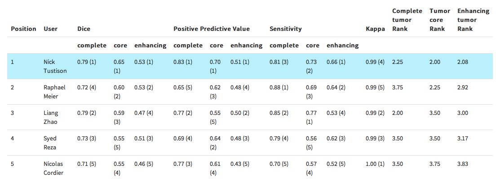

```{r setup,eval=TRUE,results='hide',warning=FALSE,echo=FALSE,message=FALSE}
booleval<-FALSE
library(knitr)
library(rmarkdown)
options(width=50)
opts_chunk$set(fig.path='figure/antsr-',fig.align='center',fig.show='hold',size='footnotesize')
getPckg <- function(pckg) install.packages(pckg, repos = "http://cran.r-project.org")
library( ANTsR )
library( oro.nifti )
library( visreg )
library( ggplot2 )
library( boot )
library( candisc )
library( pheatmap )
library( MASS )
ageregions<-"Not calculated"
myregion<-"CentralSulcus"
bd="/Users/stnava/Documents/writing/RMI/stnava"
setwd(bd)
sccansig=0
```


# Intro

## Setup

* we assume you have *ANTsR

* `git clone http://github.com/stnava/RMI.git`

* `cd RMI/stnava`

* `git clone http://github.com/stnava/RMI_Data.git`

* in *R*, `install.packages("rmarkdown")` 

* in *R*, `rmarkdown::render("rmi.Rmd")`

## Tutorial Goals
* Learn about *R*
in general (operations, dataframes, models) and *ANTsR*
* Understand basics of *R*
image-based statistics (I/O, accessing
values, structure, function)
* Practice some example reproducible studies ...
* Identify opportunities for innovation/future work
* A good source on data analysis with *R*
examples: [Advanced
Data Analysis from an Elementary Point of View](http://www.stat.cmu.edu/~cshalizi/uADA/12/lectures/ADAfaEPoV.pdf)


## *R* is relevant to your work

We entered a competition with *R*
in our holster.




## The first 3 rules of statistics:

> Draw a picture, Draw a picture, Draw a picture.
> --Michael Starbird


## *R* in medical imaging?

Search "r-project.org $+$ medical $+$ imaging"

```{r}
dd<-read.csv('RMI_Data/RMI.csv')
mdl<-lm( NPublications ~ Year +I(Year^2), data = dd)
```


## *R* in medical imaging?

*R* contains virtually all popular statistical and machine learning algorithms, including Boosting, the LASSO, and random
forests, often contributed by the inventors.
```{r vr,echo=FALSE}
visreg(mdl,main='Total Publications In Year X')
```


## Why use *R* in medical imaging?

* It's free --- not "free" like Matlab/SPM but really free

* It is the *de facto* standard for statistical computing

* a New York Times article from 2009 estimated
that there are at least 250,000 active R users

* Why not use Python?

* IMHO, *R* is easier to compile/maintain/install

* Visualization in *R* is as good or better than Python

* Most importantly---*statisticians contribute directly to R*

* Because of this, many Python users rely on *R*

* *R* facilitates reproducible research:

* [CRAN Task View](http://cran.r-project.org/web/views/ReproducibleResearch.html)

* [Biostatistics](http://biostatistics.oxfordjournals.org/content/10/3/405.long)

* [jstatsoft](http://www.jstatsoft.org/)

* *R* assists reproducible medical image analysis but it's still
effortful to do it correctly.  See
[comments on reproducibility in Frontiers](http://www.frontiersin.org/Journal/10.3389/fnins.2013.00162/full)


# SetUp


## Set up for Medical Image Analysis

Let's assume you downloaded the latest 3.x version of *R*
from CRAN.

##  We now open *R*

Install MIA-relevant packages.

```{r,echo=FALSE,results='hide'}
# some setup
options(width=60)  # make the printing fit on the page
set.seed(1121)   # make the results repeatable
library( ANTsR )
library( oro.nifti )
```


## Packages
```{r}
pkgnames <- c( "visreg" , "boot" , "rgl",
 "knitr" , "ggplot2","oro.nifti" ,
 "candisc" , "pheatmap" )
k<-length( pkgnames )
```

## Next actually install the packages.

```{r,eval=FALSE}
install.packages( pkgnames )
```


##

We installed `r k[1]` packages.


## What is `knitr` or `rmarkdown`?
* Yihui Xie's system
[http://yihui.name/knitr/](http://yihui.name/knitr/) for making
**documents that compute**

* `knitr` lets you write a document that employs *R*
directly

* *R*
evaluates code when the document is compiled

* The user controls when this does / does not happen ...

* Creates, figures, statistics etc that are embedded in rst, html,
latex, pretty much any common document format is doable.

## Simple `knitr` Example

Use `knitr` to make a couple of plots in our code "chunk":

```{r,boring-plots-data,echo=FALSE,results='hide'}
# par(las=1,mar=c(4,4,.1,.1))  # tick labels direction
```

```{r,boring-plots,fig.width=4,fig.height=4,out.width='.45\\linewidth',dev='pdf'}
x <- rnorm( 20 )
boxplot( x )
hist( x , main='', col="blue", probability = TRUE )
lines( density( x ), col = "red" )
```


## *R* $\star$Very$\star$ Basics

*R*
organizes data with dataframes, vectors, matrices and arrays (matrices with $\ge$
3 dimensions).

These can contain missing variables - but you must be careful about type!
```{r,out.width='.4\\linewidth'}
as.numeric( as.character( c("0.5",0.1,0.6,"A") ) )
```
A data frame is used for storing data tables. It is a list of vectors
of equal length.


## *R* $\star$Very$\star$ Basics 2

`mtcars` is a built-in *R*
dataframe \newline \newline
```{r,out.width='.4\\linewidth',results='show',eval=TRUE,echo=TRUE}
mtcars[c(1,13,28),1:6]
```

## MPG example

We analyze the relationship between MPG and other variables.

```{r,out.width='.4\\linewidth',results='hide'}
myform<-paste( colnames( mtcars )[2:ncol(mtcars)] , collapse='+'  )
myform<-as.formula( paste( "mpg~", myform ) )
mdl <- lm(  myform , data = mtcars )
mdla<-stepAIC( mdl , direction =  c("both" ) )
```


## *R* $\star$Very$\star$ Basics 3

```{r,out.width='.4\\linewidth',eval=TRUE,results='show',echo=FALSE}
print( summary( lm(  mdla$call$formula , data = mtcars ) ) )
```
Vehicle weight ,  1/4 mile time  and Transmission type are most predictive!


## *R* $\star$Very$\star$ Basics: Draw a Picture

```{r,out.width='.35\\linewidth',dev='pdf',eval=TRUE,results='show',echo=TRUE}
mdl <- lm(  mdla$call$formula , data = mtcars )
visreg( mdl, xvar="wt")
visreg( mdl, xvar="qsec")
visreg( mdl, xvar="am")
```

**Oops! Transmission type should be a factor.**


## *R* $\star$Very$\star$ Basics: Draw a Picture Fix

```{r,out.width='.35\\linewidth',dev='pdf',eval=TRUE,results='show',echo=TRUE}
mtcars$am<-as.factor( mtcars$am )
mdl <- lm(  mdla$call$formula , data = mtcars )
visreg( mdl, xvar="wt")
visreg( mdl, xvar="qsec")
visreg( mdl, xvar="am")
```
This is better ...


## *R* $\star$Very$\star$ Basics: Draw a Picture 3

```{r,out.width='.6\\linewidth',dev='pdf',echo=TRUE,eval=TRUE,results='hide'}
 coplot(mpg ~ wt | qsec , data = mtcars,
   panel = panel.smooth, rows = 1)
```


# Medical Image Representations

## Data representation standards

Represent an image as a *vector* (more on this later).  This
vector may be derived from a 2 or 3D array of spatially related voxels.
```{r,imgvec,out.width='.25\\linewidth',dev='pdf'}
nvox    <- 100
imgvec <- rnorm( nvox )
mydat<-data.frame( space = 1:nvox, imgvec = imgvec )
ggplot(data=mydat, aes(x=space, y=imgvec, group=1)) + geom_line()
```


## Data Representation

Represent an image set as a *matrix*.

```{r imgmat}
nSubjectsOrTimePoints <- 5
imgmat <- matrix(
  rep( NA, nSubjectsOrTimePoints * nvox ) , ncol=nvox )
for ( i in 1:nSubjectsOrTimePoints )
  imgmat[ i , ] <- rnorm( nvox )
```


## Data Representation

```{r imgmat2,echo=FALSE}
pheatmap::pheatmap( imgmat )
```


## Reading Images

Read em and weep

```{r,myio,echo=TRUE,eval=TRUE,warning=FALSE,results='show',fig.width=4,fig.height=4,out.width='.45\\linewidth'}
fn<-getANTsRData( "ch2" , usefixedlocation = FALSE  )

# oro.nifti
colin <- readNIfTI( fn )

# antsr
colina <- antsImageRead( fn )
```


## Quickly Show Images by oro.nifti
```{r,myviz,echo=TRUE,eval=TRUE,warning=FALSE,results='hide',fig.width=4,fig.height=4,out.width='.8\\linewidth'}
orthographic( as.array( colina ), oma=rep(2,4))
```

## Quickly Show Images w/ANTsR
```{r,myviza,echo=TRUE,warning=FALSE,eval=TRUE,tidy=TRUE,results='hide',fig.width=4,fig.height=4,out.width='.9\\linewidth'}
plot( as.antsImage( colin ) , axis=1 )
```


## Convert an Image to a Vector
Use *ANTsR* to convert an image to a vector.
```{r,convvec,echo=TRUE,warning=FALSE,eval=TRUE,tidy=TRUE,results='hide',fig.width=4,fig.height=4,out.width='.4\\linewidth'}
imgvec<-colina[  colina > 50  ]
print( length( imgvec ) )
```
Use  oro.nifti to convert an image to a vector.
```{r,convvec2,echo=TRUE,warning=FALSE,eval=TRUE,tidy=TRUE,results='hide',fig.width=4,fig.height=4,out.width='.4\\linewidth'}
imgvec<-colin[  colin > 50  ]
print( length( imgvec ) )
```
Both packages enable similar functionality in terms of accessing /
converting images to vectors.  *ANTsR* allows I/O to files other than
nifti such as meta, jpg, dicom, etc, anything ITK reads/writes.

# Quantifying Images


## Image Quantification with *R*

It is possible to implement full processing pipelines with *R*
for submission to distributed computing systems ...

My knowledge is limited to *ANTsR*.

There are also packages TractR, fMRI, dce-MRI and likely many more.

See the [medical imaging task view on CRAN](http://cran.r-project.org/web/views/MedicalImaging.html).


## The Basic Toolset from outside *R*

\textcolor{blue}{Registration: Data is in Examples/Data}
```bash
antsRegistration -d 2 
 -m CC[r16slice.nii.gz,r64slice.nii.gz,1,4]
 -t SyN[0.25,3,0]  -o TEST -i 50x40x30 -c 50
```
`antsRegistration` in *ANTsR*

\textcolor{blue}{Segmentation}
```bash
Atropos -d 2 -a r16slice.nii.gz -x r16mask.nii.gz
-m [0.1,1x1]   -c [10,0]  -i kmeans[3]\newline
-o [Output.nii.gz,Output\_prob\_\%02d.nii.gz]
```
`atropos` in *ANTsR*

`antsApplyTransforms` in both

## The Basic Toolset from outside *R*

\textcolor{blue}{Template building}
```bash
 bash buildtemplateparallel.sh -d 3 -m 30x50x20
-t GR  -s CC -c 1 -o OutPrefix  *ImageName*T1x.nii.gz
```
not available in *ANTsR*

# Classical Statistics

##  Basic Linear Regression
This is a simple regression study that associates diagnosis (dx) with
a local Jacobian-based volume measurement.

We also look at global volume.

```{r,vreg1,echo=TRUE,eval=TRUE,results='show',fig.width=4,fig.height=4,out.width='.4\\linewidth'}
predictor<-as.factor(
  read.csv("RMI_Data/phantpredictors.csv")$dx )
gvol<-read.csv("RMI_Data/globalvols.csv")
mdl<-lm( vol ~  predictor , data=gvol )

```

This is simulated data ....


##  Basic Linear Regression Output
```{r,vreg2,echo=TRUE,eval=TRUE,results='show',fig.width=4,fig.height=4,out.width='.4\\linewidth'}

summary(mdl)

```


##  Basic Linear Regression Visualization
visreg has easy to use "natural" visualizations for regression ...
```{r,vreg3,echo=TRUE,eval=TRUE,results='show',out.width='.5\\linewidth',dev='pdf'}

visreg(mdl)

```
Next apply the global test to the voxelwise morphometry case.


##  .... voxel-wise statistics in *R*
\transdissolve
```{r,voxelwise,echo=TRUE,results='hide',warning=FALSE,highlight=TRUE,eval=TRUE}
mask<-antsImageRead( "RMI_Data/phantmask.nii.gz", 2 )
logjac<-read.csv("RMI_Data/phantomGlogjacs.csv") # a population of images
nvox<-ncol(logjac)
pvals<-rep(NA,nvox)
for ( x in c(1:nvox) ) {
  voxels<-logjac[,x]
  lmres<-summary(lm( voxels ~  predictor , data=gvol ))
  coeff<-coefficients( lmres )
  pval<-coeff[2,4]
  pvals[x]<-pval
}
qvals<-p.adjust(pvals,method="BH") # holm recommended over BH
pvali<-makeImage( mask, 1-qvals )
```
Exercise: What happens when you include globalvol as a covariate?

##  Visualizing voxel-wise statistics in *R*

```{r,echo=FALSE,out.width='.8\\linewidth'}
plot( mask, list( pvali ), window.overlay=c(0.95,1) )
```
The regression solution p-values thresholded at 0.05 FDR-corrected.

**Should use `bigLMStats` - much faster.**


##  .... multivariate statistics in *R*
\transdissolve
```{r,multivar,echo=TRUE,eval=TRUE,results='hide',warning=FALSE}
continuousDX <- 1-as.numeric(predictor)
continuousDX2 <- gvol
mypreds<-as.matrix( cbind( continuousDX, continuousDX2 ) )
sccan<-sparseDecom2( inmatrix=list( as.matrix(logjac), mypreds ),
inmask = c( mask , NA ) , mycoption=1,
   sparseness=c( 0.25, -1 ), nvecs=1, its=10, smooth=1, perms=200 )
sccansol <- sccan$eig1[[1]] %>% iMath("Normalize")
sccansig=sccan$ccasummary$Variate000[1]
```
The sccan solution has p-value `r sccansig`.

Exercise: What happens when you include globalvol as a covariate?

##  Visualizing multivariate statistics in *R*
\transdissolve

```{r sccanviz,echo=FALSE,out.width='.6\\linewidth',message=FALSE,warning=FALSE,eval=TRUE}
plot( mask, sccansol, window.overlay=c(0.05,1) )
```


## ANOVA 1
How do we assess the importance of multiple predictors acting together
within classic regression?
```{r,anova1,echo=TRUE,eval=TRUE,results='show',warning=FALSE,out.width='.4\\linewidth'}
nki<-read.csv('RMI_Data/labelresultsN.csv')
print(names(nki)[1:8])
```


## ANOVA 1
```{r,anova1ph,echo=TRUE,eval=TRUE,results='show',warning=FALSE}
pheatmap::pheatmap(cor(as.matrix(nki[,4:37])))
```


## ANOVA 2
How do we assess the importance of multiple predictors acting together
within classic regression?
```{r,anova2,echo=1:3,eval=TRUE,results='show',warning=FALSE}
mdl1<-lm( LABEL_14 ~ SEX + VOLUME , data=nki )
mdl2<-lm( LABEL_14 ~ SEX + VOLUME + AGE + I(AGE^2) , data=nki )
print( anova(mdl1,mdl2) )
jpeg(file="./figure/antsrAge.jpeg",quality = 95, width=900,height=450)
visreg(mdl2,xvar="AGE")
dev.off()
```


## ANOVA 3
Assess importance of multiple predictors acting together.
\begin{figure}[h]
  \centering
  \includegraphics[width=0.9\textwidth]{figure/antsrAge.jpeg}
  \caption{The quadratic regression of age against thickness while
  controlling for gender and brain volume}
\end{figure}


# Multivariate Methods for "Big Data"


## What is multiple regression?
The solution to a quadratic minimization problem:
\begin{block}{Multiple Regression
$$
\|  y - X \beta \|^2  +  \textcolor{blue}{\lambda \| \beta \| ^2}
$$
Solved by ordinary least squares methods:
$$
\hat{\beta}=( X^T X)^{-1} X^T y
$$
with theory for turning $\beta$ entries into "significance" measurements.
}
\end{block}
The "ridge" penalty is useful if $p >> n$.


## Principal Component Analysis
Also the solution to a quadratic minimization problem:
\begin{block}{PCA: $U$, $V$ minimize reconstruction error:
$$
\|  X  - U V^T \|^2   +  \textcolor{blue}{\sum_k \lambda_k \| V_k
\|_1}
$$
Each of the columns of $X$ is a linear combination of the
columns of $U$.
}
\end{block}

## Principal Component Analysis

Easy solution in *R*
(w/o penalties):
```{r,out.width='.4\\linewidth',eval=FALSE,echo=TRUE,show='hide'}
mysolution=svd(X)
# or prcomp(X) if X not centered
```

The $\ell_1$ penalty is useful if $p >> n$.


## Principal Component Analysis Example
```{r,out.width='.8\\linewidth',eval=TRUE,show='hide',echo=FALSE}
PCbiplot <- function(PC, x="PC1", y="PC2") {
    # PC being a prcomp object
    data <- data.frame(obsnames=row.names(PC$x), PC$x)
    plot <- ggplot(data, aes_string(x=x, y=y)) + geom_text(alpha=.4, size=3, aes(label=obsnames))
    plot <- plot + geom_hline(aes(0), size=.2) + geom_vline(aes(0), size=.2)
    datapc <- data.frame(varnames=rownames(PC$rotation), PC$rotation)
    mult <- min(
        (max(data[,y]) - min(data[,y])/(max(datapc[,y])-min(datapc[,y]))),
        (max(data[,x]) - min(data[,x])/(max(datapc[,x])-min(datapc[,x])))
        )
    datapc <- transform(datapc,
            v1 = .7 * mult * (get(x)),
            v2 = .7 * mult * (get(y))
            )
    plot <- plot + coord_equal() + geom_text(data=datapc, aes(x=v1, y=v2, label=varnames), size = 5, vjust=1, color="red")
    plot <- plot + geom_segment(data=datapc, aes(x=0, y=0, xend=v1, yend=v2), alpha=0.75, color="red")
    plot
}
fit <- prcomp(USArrests, scale=T)
```

```{r,out.width='.85\\linewidth',dev='pdf',echo=FALSE,eval=TRUE}
PCbiplot(fit)
```


## Canonical Correlation Analysis
\begin{block}{CCA Generalizes Multiple Regression
$$  Y V + \textcolor{blue}{\sum_k \lambda_k \| V_k \|_1} \propto X W  + \textcolor{blue}{\sum_k \gamma_k \| W_k \|_1}$$
where $Y, V, X, W$ are matrices and $V, W$ are canonical variates (the
CCA solutions).
}
\end{block}

## Canonical Correlation Analysis
Also easy in *R*
(SVD used internally):
```{r,out.width='.4\\linewidth',echo=TRUE,eval=TRUE,results='hide'}
 enginedata<-mtcars[,c(2,3,4,11)]
 outputdata<-mtcars[,c(1,7)]
 mycca<-cancor( enginedata, outputdata )
```

CCA is "symmetric" in that the sets X and Y have equivalent
status.  A truly multivariate multiple regression.


## Canonical Correlation Analysis Visualization 1
```{r,out.width='.7\\linewidth',dev='pdf',echo=TRUE,eval=TRUE,warning=FALSE,results='show'}
print( mycca )
```


## Canonical Correlation Analysis Visualization 2
```{r,out.width='.65\\linewidth',dev='pdf',echo=TRUE,eval=TRUE,warning=FALSE,results='hide'}
heplot(mycca, xpd=TRUE, scale=0.3)
```


## Sparse multiple regression/PCA/CCA
Any of the methods can be made sparse by enforcing the penalties
previously highlighted in \textcolor{blue}{blue}.

**Sparse Optimization**

* Formulate the problem as a constrained optimization.
* Identify the gradient descent solution---*without
sparseness.
* Use projected gradient descent to solve the optimization---*with sparseness*.
* In imaging, other constraints are valuable too.


## *R* Multivariate Study - PBAC with `SCCAN`


## *R* Multivariate Study - PBAC with `SCCAN`

* Sparse canonical correlation analysis for neuroimaging

* Compare training/testing reliability wrt voxel-wise univariate feature selection

* Problem: find gray matter voxels in training that predict cognitive data in testing

* Here, compare to ROIs.  Also, use full cognitive battery (not sub-batteries).


## *R* Multivariate Study - PBAC

PBAC: *R* ready medical imaging data.

```{r,out.width='.4\\linewidth',results='hide',eval=TRUE,echo=TRUE}
pbacc<-list.files(path = "./RMI_Data", pattern = glob2rx("pbac*csv")  ,
full.names = T )
pbacTEcog<-read.csv(pbacc[1])
pbacTRcog<-read.csv(pbacc[2])
pbaci<-list.files(path = "./RMI_Data", pattern = glob2rx("pbac*mha") ,
full.names = T )
pbacTEimg<-as.matrix( antsImageRead(pbaci[1] ) )
pbacTRimg<-as.matrix( antsImageRead(pbaci[2] ) )
```


## *R* Multivariate Study - PBAC

We have training (n=`r nrow(pbacTRimg)`)/testing (n=`r nrow(pbacTEimg)`) data images $+$ psychometrics
and analyze the relationship between gray matter and cognition.
```{r,out.width='.4\\linewidth',results='show',eval=TRUE,echo=TRUE}
pbacTRcog[c(1,13,28),1:6]
# also pbac imaging data comes from this mask
mask<-antsImageRead( list.files(path = "./RMI_Data", pattern=glob2rx("gmask_2mmb.nii.gz") , full.names=T ) , 3 )
# with anatomical labels
pbacaal<-antsImageRead( list.files(path = "./RMI_Data",
pattern=glob2rx("pbac_aal.nii.gz"), full.names=T ) , 3 )
data("aal",package="ANTsR") # description of aal
```


## *R* Multivariate - PBAC ROIs
```{r,out.width='.4\\linewidth',eval=TRUE,results='hide',echo=TRUE}
inmask <-  mask > 0.5
mylabs<-sort( unique( pbacaal[ inmask  &  
  pbacaal > 0.5 &  pbacaal < 91   &  pbacaal != 51 &  
  pbacaal != 52 &  pbacaal != 53 &  pbacaal != 54 ] ) )
roimatrix<-matrix( rep( NA, length( mylabs ) 
    * nrow( pbacTRimg ) ) , ncol=length(mylabs ) )
for ( i in 1:length(mylabs) ) { # get vector for this label
  labelVec <- as.numeric( pbacaal[ inmask ] == mylabs[ i ] )
  roimatrix[,i]=pbacTRimg %*% ( labelVec / sum( labelVec ) )
  }
colnames( roimatrix ) <- aal$label_name[ mylabs ]
mydf<-data.frame( pbacTRcog, roimatrix )
```
Next we will analyze these ROIs and their relationship with demographics.


## *R* Multivariate: Inspect Data - PBAC cog
```{r,out.width='.7\\linewidth',dev='pdf',eval=TRUE,results='show',echo=TRUE}
pheatmap( cor( pbacTRcog ) , cluster_rows = F , cluster_cols =  F )
```


## *R* Multivariate: Inspect Data - PBAC Cog Constellation Plot
```{r,out.width='.75\\linewidth',dev='pdf',eval=TRUE,results='show',echo=FALSE}
stars( pbacTRcog,
       labels = row.names(mydf), cex = 0.2, scale = TRUE, radius = FALSE, full = TRUE, flip.labels = FALSE,
       mar = c( 0, 0, 2, 0 ), main = "Brain Constellation Map of PBAC Cognition" )
```


## *R* Multivariate: Inspect Data - PBAC ROI
```{r,out.width='.8\\linewidth',dev='pdf',eval=TRUE,results='show',echo=FALSE}
pheatmap( cor( roimatrix ) , cluster_rows = F , cluster_cols =  F )
```


## *R* Basics: Inspect Data - PBAC ROI Constellation Plot
```{r,out.width='.75\\linewidth',dev='pdf',eval=TRUE,results='show',echo=FALSE}
stars( roimatrix,
       labels = row.names(mydf), cex = 0.2, scale = TRUE, radius = FALSE, full = TRUE, flip.labels = FALSE,
       mar = c( 0, 0, 2, 0 ), main = "Brain Constellation Map of PBAC ROIs" )
```


## 1200 Subject Constellation Plot
\begin{figure}[t]
\includegraphics[width=2.75in]{./figure/constellation.pdf}
\caption{Data-inspection for a large-scale study.}
\end{figure}


## *R* Multivariate: Inspect Data - PBAC cog $\leftrightarrow$ ROI
```{r,out.width='.7\\linewidth',dev='pdf',eval=TRUE,results='show',echo=TRUE}
pheatmap( cor( pbacTRcog , roimatrix ) , cluster_rows = F , cluster_cols =  F )
```


## *R* Multivariate - PBAC ROI Study
```{r,out.width='.4\\linewidth',eval=TRUE,results='hide',echo=TRUE}
myform<-paste( colnames( roimatrix ), collapse='+'  )
myform<-as.formula( paste( "delay_free_adj~", myform , 
                           "+edu") )
mydf<-data.frame( pbacTRcog, roimatrix )
row.names(mydf)<- paste( c(1:nrow(pbacTRcog)),
              "_",as.character( pbacTRcog$mmse ),sep='')
mdl <- lm(  myform , data = mydf )
mdla<-stepAIC( mdl  , trace = 0 )
ageregions<-gsub("_","",as.character(mdla$call$formula)[3])
```

## *R* Multivariate - PBAC ROI Study
Various brain regions, together, predict naming\_adj ... `r ageregions`.


## *R* Multivariate: Draw a Picture - PBAC
```{r,out.width='.3\\linewidth',dev='pdf',eval=TRUE,results='show',echo=TRUE}
visreg( mdla, xvar="Angular_L")
visreg( mdla, xvar="Frontal_Mid_R")
visreg( mdla, xvar="Temporal_Pole_Sup_L")
```


## *R* Multivariate: PBAC Draw a Picture 2
```{r,out.width='.6\\linewidth',dev='pdf',echo=TRUE,eval=TRUE,results='hide'}
 coplot( delay_free_adj ~ Angular_L + Frontal_Mid_R + Temporal_Pole_Sup_L | age , data = mydf , panel = panel.smooth, rows = 1)
```


## *R* Multivariate: PBAC SCCAN
Run SCCAN between raw GM data and cognition
```{r,out.width='.6\\linewidth',dev='pdf',echo=2,eval=TRUE,results='hide'}
nv<-10
mysccan<-sparseDecom2( 
  inmatrix=list( as.matrix(pbacTRcog), pbacTRimg), 
  inmask=c( NA , mask ), smooth = 1 , statdir ="/tmp/", 
  robust = 0 , sparseness=c( -0.07, 0.05 ), mycoption=1,
  nvecs=nv, its=10 , perms=0, cthresh=c(0,250) )
```

## *R* Multivariate: PBAC SCCAN
```{r,out.width='.6\\linewidth',dev='pdf',echo=FALSE,eval=TRUE,results='show'}
for ( ind in 1:nv ) {
  mytests<-names( pbacTRcog )[ abs( mysccan$eig1[,ind] ) > 0 ]
  myform<-paste( mytests , collapse="+" )
  vec<-antsImageRead( paste("/tmp/sccaView2vec00",ind-1,".nii.gz",sep='') ,  3 )
  vec<-vec[ inmask ]
  traindf<-data.frame( gm= pbacTRimg %*% vec, pbacTRcog )
  myform<-as.formula( paste( "gm~",myform) )
  predlm<-lm(  myform , data=traindf )
  predcog<-predict( predlm , newdata=pbacTRcog )
  gmtest<-c( pbacTRimg %*% vec )
  print( myform )
  print( paste("Train Correlation:",ind, cor.test( gmtest, predcog)$est  ) )
  }
```


# Predictive Statistical Methods

## Prediction: PBAC---Cognition from ROIs
Get the testing data ROIs (code hidden).
```{r,echo=FALSE,warning=FALSE,eval=TRUE,tidy=TRUE,results='hide'}
testroi<-matrix( rep( NA, length( mylabs ) * nrow( pbacTEimg ) ) ,ncol=length(mylabs ) )
for ( i in 1:length(mylabs) ) {
  labelVec <- as.numeric( pbacaal[ inmask ] == mylabs[ i ] )
  testroi[   , i  ] <- pbacTEimg %*% ( labelVec / sum( labelVec ) )
  }
colnames( testroi )<-colnames( roimatrix )
testdf<-data.frame( testroi , edu = pbacTEcog$edu )
```

## Predict the naming from test ROI data w/ ordinary regression.

```{r,predictpbac0,echo=1:2,warning=FALSE,eval=TRUE,tidy=TRUE,results='show',fig.width=4,fig.height=4,out.width='.4\\linewidth',dev='pdf'}
predcog<-predict( mdla , newdata=testdf )
print( paste("Test Correlation:", cor.test( pbacTEcog$delay_free_adj, predcog)$est  ) )
predmdl<-lm(  predcog ~ 1 + delay_free_adj, data = pbacTEcog )
visreg( predmdl )
```

## Prediction: PBAC---Cognition from Brain
Predict the test voxel data from cognition id'd by SCCAN.
```{r,predictpbac,echo=TRUE,warning=FALSE,eval=TRUE,tidy=TRUE,results='show',fig.width=4,fig.height=4,out.width='.4\\linewidth',dev='pdf'}
```{r,out.width='.6\\linewidth',dev='pdf',echo=FALSE,eval=TRUE,results='show'}
for ( ind in 1:nv ) {
  mytests<-names( pbacTRcog )[ abs( mysccan$eig1[,ind] ) > 0 ]
  myform<-paste( mytests , collapse="+" )
  vec<-antsImageRead( paste("/tmp/sccaView2vec00",ind-1,".nii.gz",sep='') ,  3 )
  vec<-vec[ inmask ]
  traindf<-data.frame( gm= pbacTRimg %*% vec, cog = as.matrix( pbacTRcog) %*% mysccan$eig1[,ind ] )
  cogtest <- as.matrix( pbacTEcog) %*% mysccan$eig1[,ind ]
  gmtest<-c( pbacTEimg %*% vec )
  print( myform )
  print( paste("Test Correlation:",ind, cor.test( gmtest, cogtest)$est  ) )
}
```
The SCCAN model is equally predictive but much more specific.


## Prediction: PBAC---Cognition from Brain
```{r,predictpbac2a,echo=TRUE,warning=FALSE,eval=TRUE,tidy=TRUE,results='show',fig.width=4,fig.height=4,out.width='.7\\linewidth',dev='pdf'}
ind=2
mytests<-names( pbacTRcog )[ abs( mysccan$eig1[,ind] ) > 0 ]
myform<-paste( mytests , collapse="+" )
vecimg<-antsImageRead( paste("/tmp/sccaView2vec00",ind-1,".nii.gz",sep='') )
vec<-vecimg[ inmask ]
traindf<-data.frame( gm= pbacTRimg %*% vec, cog = as.matrix( pbacTRcog) %*% mysccan$eig1[,ind ] )
cogtest <- as.matrix( pbacTEcog) %*% mysccan$eig1[,ind ]
gmtest<-c( pbacTEimg %*% vec )
predmdl<-lm(  cogtest ~ c(gmtest) , data = pbacTEcog )
print( paste("Test Correlation:",names(pbacTEcog)[ which( mysccan$eig1[,ind ] > 0 )],  cor.test( cogtest, gmtest )$est  ) )
```


## Prediction: PBAC---Cognition from Brain
```{r,predictpbac2b,echo=FALSE,warning=FALSE,eval=TRUE,tidy=TRUE,results='show',fig.width=4,fig.height=4,out.width='.7\\linewidth',dev='pdf'}
ind=2
print( paste("Test Correlation:",names(pbacTEcog)[ which( mysccan$eig1[,ind ] > 0 )],  cor.test( cogtest, gmtest )$est  ) )
visreg( predmdl )
```

## Localization 

```{r,echo=FALSE,eval=TRUE}
plot( mask , vecimg %>% iMath("Normalize"), window.overlay=c(0.1,1), axis=3, nslices=20 )
```


## Localization 

```{r,echo=FALSE,eval=TRUE}
plot( mask , vecimg %>% iMath("Normalize"), window.overlay=c(0.3,1), axis=3, nslices=20 )
```

## Cross-Validation of Diagnosis

```{r,out.width='.4\\linewidth',eval=TRUE,results='hide',echo=TRUE}
dx<-as.factor( pbacTRcog$mmse < 26  )
dx<-as.factor( pbacTRcog$fluency_adj < 2.6  )
traindata<-data.frame( dx=dx, roimatrix )
myform<-paste( "dx~", paste( colnames( roimatrix )[1:20] , collapse='+' ) )
mdl<-glm( as.formula(myform), data=traindata, family="binomial")
dd<-0 ; ntests<-20
for ( i in 1:ntests ) dd<-dd+cv.glm(traindata, mdl,K=5)$delta[1]* ( 1/ ntests )
```
Reasonable classification rates.
```{r,out.width='.4\\linewidth',eval=TRUE,results='show',echo=FALSE}
print(paste("prediction % misclassification" , dd * ntests ) )
```


# functional mri tools


## BOLD fMRI Motor Tasks I/O and setup
"A test-retest fMRI dataset for motor, language and spatial attention
functions" --- Gorgolewski, et al. Gigascience, 2013.

Subject: 08143633

```{r,boldmotor1,echo=TRUE,warning=FALSE,eval=TRUE,tidy=TRUE,results='hide',fig.width=4,fig.height=4,out.width='.4\\linewidth'}
blockfing = c(0, 36, 72, 108,144)
blockfoot = c(12, 48, 84, 120, 156)
ct<-1
fn<-c('RMI_Data/fmri_motor_sub1_s1.nii.gz','RMI_Data/fmri_motor_sub1_s2.nii.gz')
pre<-paste('fmri_motor_',ct,sep='')
```


## BOLD fMRI Motor Tasks I/O, setup Subject 2

```{r,boldmotor2,echo=TRUE,warning=FALSE,eval=TRUE,tidy=TRUE,results='hide',fig.width=4,fig.height=4,out.width='.4\\linewidth'}
  fmri<-antsImageRead( fn[1]  )
  hrf <- hemodynamicRF( scans=dim(fmri)[4] , onsets=blockfing , durations=rep(  12,  length( blockfing ) ) ,  rt=2.5 )
  hrf[1:4]<-0 # first few frames are junk
#  myvars<-getfMRInuisanceVariables( fmri, moreaccurate = TRUE ,  maskThresh=100 )
boldpre=preprocessfMRI( fmri, maskingMeanRatioThreshold = 0.75,
  numberOfCompCorComponents = 8, doMotionCorrection = TRUE, 
  useMotionCorrectedImage = TRUE, spatialSmoothingType='gaussian',
  spatialSmoothingParameters = mean( antsGetSpacing(fmri)[1:3] ), 
  motionCorrectionAccuracyLevel = 1, residualizeMatrix = FALSE )
```


## BOLD fMRI Motor Tasks 2
The previous functions compute *R*
friendly variables for fMRI
processing: Nuisance, mean, mask, matrix.  $+$ the HRF.
```{r,boldmotor3,echo=TRUE,warning=FALSE,eval=TRUE,tidy=TRUE,results='hide',fig.width=4,fig.height=4,out.width='.4\\linewidth'}
  avg<-getAverageOfTimeSeries( fmri )
  mask=antsImageClone( boldpre$maskImage ) 
  nuis<-( boldpre$nuisanceVariables )
  print( colnames( nuis ) )
  antsImageWrite(avg,paste(pre,"avg.nii.gz",sep=""))
```


## BOLD fMRI Motor Tasks 3
Use multiple regression to relate a task-design (convolved with HRF) to BOLD activation.
```{r,boldmotor4,echo=TRUE,warning=FALSE,eval=TRUE,tidy=TRUE,results='hide',fig.width=4,fig.height=4,out.width='.4\\linewidth'}
# see http://mumford.fmripower.org/lev1.pdf
 mat <- timeseries2matrix( boldpre$cleanBoldImage, mask )
  desmat<-cbind(  nuis )
  desmat<-cbind( hrf=hrf, desmat )
  colnames( desmat )<-c("hrf",colnames(nuis))
  mdl=lm( mat ~  ., data = data.frame( desmat )  )
  blm=bigLMStats( mdl )
  betas = blm$beta.t["hrf",]
  betathresh<-( mean( betas[betas>0.1] )+ 2.0 * sd(  betas[betas>0.1] ) )
  betaimg<-makeImage(mask, betas )
  print( paste( max( betas )  , betathresh  ) )  # around 10 or so
  antsImageWrite(betaimg, paste(pre,"betas.nii.gz",sep="") )
```

## BOLD fMRI Motor Tasks Viz

```{r,boldmotor5a,echo=FALSE,warning=FALSE,eval=TRUE,tidy=TRUE,results='hide',fig.width=4,fig.height=4,out.width='.8\\linewidth'}
  mx<-max( betas )
  plot( avg, list(betaimg),  axis = 3, window.overlay=c(3,max(betaimg)))
```

## BOLD fMRI Motor Tasks Viz

```{r,boldmotor5b,echo=FALSE,warning=FALSE,eval=TRUE,tidy=TRUE,results='hide',fig.width=4,fig.height=4,out.width='.8\\linewidth'}
 if ( ! exists("mymni") ) {
    mymni<-list( antsImageRead(getANTsRData('mni'),3),
                 antsImageRead(getANTsRData('mnib'),3),
                 antsImageRead(getANTsRData('mnia'),3) )
    }
  bth=mean(betaimg[betaimg>0])+sd( betaimg[betaimg>0]  )*2
  clust <- labelClusters( betaimg , minClusterSize=20,
    minThresh= bth, maxThresh=100)
  plot( avg, clust,  axis = 3, window.overlay=c(1,max(clust)))
```

## Get Coordinates

```{r,boldmotor6,echo=TRUE,warning=FALSE,eval=TRUE,tidy=TRUE,results='hide',fig.width=4,fig.height=4,out.width='.4\\linewidth'}
 gcoords<-getTemplateCoordinates( list( avg , clust ) , mymni ,  convertToTal = TRUE  )
 knitr::kable( gcoords$templatepoints )
 myregion<-sub("_","",gcoords$templatepoints$AAL[1])
```

## Subject 1: Univariate

\begin{figure}[b]
\includegraphics[width=4.5in]{./figure/antsrLMmot1.jpeg}
\caption{Univariate results for fingertapping include `r myregion`.}
\end{figure}
Is that the "right" location?

## Subject 1: Multivariate

\begin{figure}[b]
\includegraphics[width=4.5in]{./figure/antsrsccanmot1.jpeg}
\caption{Multivariate results for fingertapping.}
\end{figure}
\begin{block}{Exercise: Fingertapping repeatability
Repeat with subjects fmri\_motor\_sub1\_s2.nii.gz and
fmri\_motor\_sub2\_s1.nii.gz
Evaluate overlap of signal.
}
\end{block}


## BOLD fMRI Signals

\begin{figure}[b]
\includegraphics[width=3.5in]{./figure/anstrboldHRF.jpeg}\newline
\includegraphics[width=3.5in]{./figure/anstrboldsig1.jpeg}\newline
\includegraphics[width=3.5in]{./figure/anstrboldsigN.jpeg}
\caption{BOLD signals.}
\end{figure}


## BOLD fMRI Language Tasks

Exercise:  Check the code below and run the language task studies from
the Gigascience article.

```{r,boldlang,echo=FALSE,warning=FALSE,eval=TRUE,tidy=TRUE,results='hide',fig.width=4,fig.height=4,out.width='.4\\linewidth'}
fmri<-antsImageRead('RMI_Data/fmri_covert_verb_generation_sub1_s2.nii.gz')
blocko = c(1,24, 48, 72, 96, 120, 144 )
hrf <- hemodynamicRF( scans=dim(fmri)[4] , onsets=blocko , durations=rep(  12,  length( blocko ) ) ,  rt=2.5 )
hrf[1:4]<-NA # first few frames are junk
boldpre=preprocessfMRI( fmri, maskingMeanRatioThreshold = 0.75,
  numberOfCompCorComponents = 8, doMotionCorrection = TRUE, 
  useMotionCorrectedImage = TRUE, spatialSmoothingType='gaussian',
  spatialSmoothingParameters = mean( antsGetSpacing(fmri)[1:3] ), 
  motionCorrectionAccuracyLevel = 1, residualizeMatrix = FALSE )

  avg<-getAverageOfTimeSeries( fmri )
  mask=antsImageClone( boldpre$maskImage ) 
  nuis<-( boldpre$nuisanceVariables )

  mat <- timeseries2matrix( boldpre$cleanBoldImage, mask )
  desmat<-cbind(  nuis )
  desmat<-cbind( hrf=hrf, desmat )
  colnames( desmat )<-c("hrf",colnames(nuis))
  mdl=lm( mat ~  ., data = data.frame( desmat )  )
  blm=bigLMStats( mdl )
  betas = blm$beta.t["hrf",]
  betathresh<-( mean( betas[betas>0.1] )+ 2.0 * sd(  betas[betas>0.1] ) )
  betaimg<-makeImage(mask, betas )
```


## BOLD fMRI Language Tasks Viz

```{r,boldmotor5,echo=FALSE,warning=FALSE,eval=TRUE,tidy=TRUE,results='hide',fig.width=4,fig.height=4,out.width='.8\\linewidth'}
  mx<-max( betas )
  plot( avg, list(betaimg),  axis = 3, window.overlay=c(3,max(betaimg)))
```


## Review So Far ...
What Have We Ignored?

* More general linear models: e.g. multinomial, logit ...
* LDA, SVM, advanced visualization, etc.
* functions/packages: *pairs, glmnet, PMA, igraph* ...
* simulation --- very valuable.
* too many *R* $\star$tricks$\star$ to remember w/o practice.

## Review So Far ...

Accomplishments!

* Image I/O \& ROI analysis
* Morphometry \& Regression
* Multivariate methods for Large Imaging Datasets
* Prediction examples ...
* fMRI: univariate \& multivariate
* ASL Cerebral Blood Flow
* Various references to valuable *R*
$\star$tricks$\star$.


# Reproducible Examples

## Example Papers based on R: SCCAN

## Example Papers based on R: Eigenanatomy

## Example Papers based on R: ASL-CBF

## Resources for Building *R*

Packages


## Discussion $+$ Future Work
